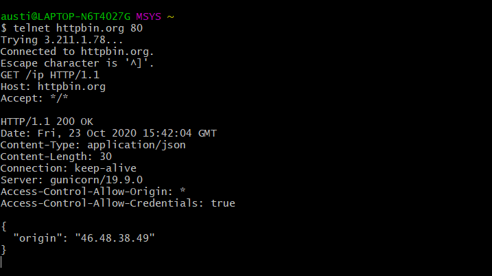
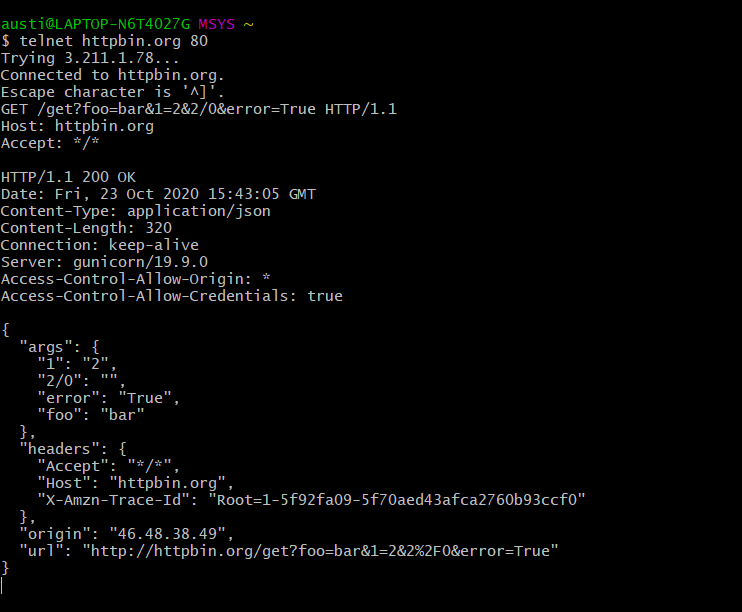

# 1

На данный запрос мы получили ответ с кодом 200 и узнали длину контента, а также поддерживаемый тип и получили тело ответа с единственным параметром origin

2
======

В ответе этого запроса мы вычислили длину контента, а в теле ответа получили объект с отправленными параметрами в виде ключ:значение и URI 

3
=====

Получили ответ 200 с длиной контента 1210, отправленными параметрами, а также URI

4
=====

Был получен ответ со статусом 302 и длиной контента 223. Данный статус означает, что  запрошенный ресурс был временно перемещен по адресу, указанному в заголовке Location
